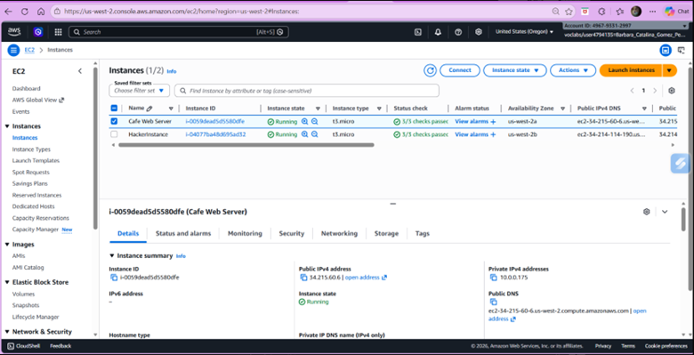
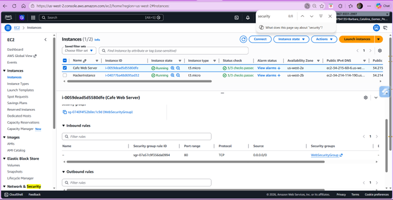
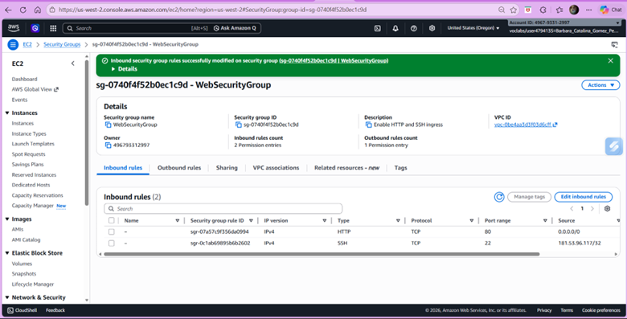
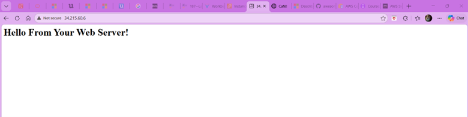
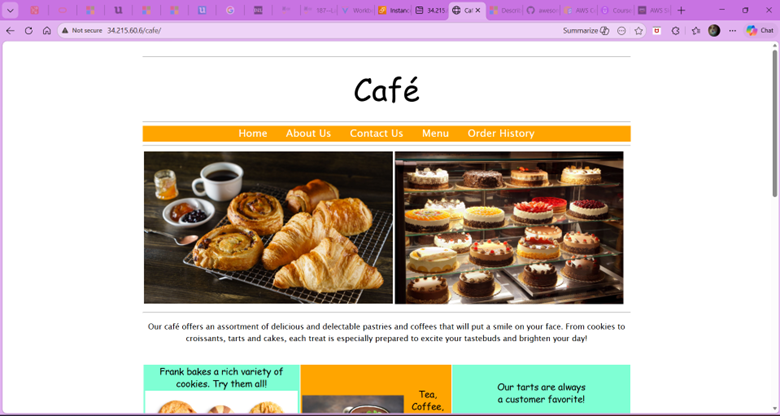
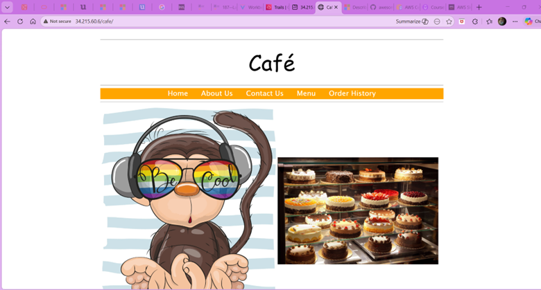
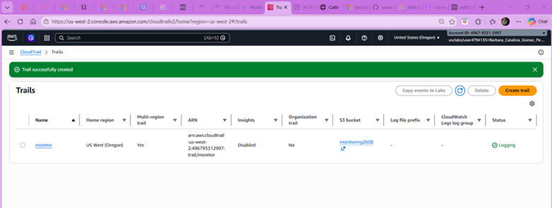
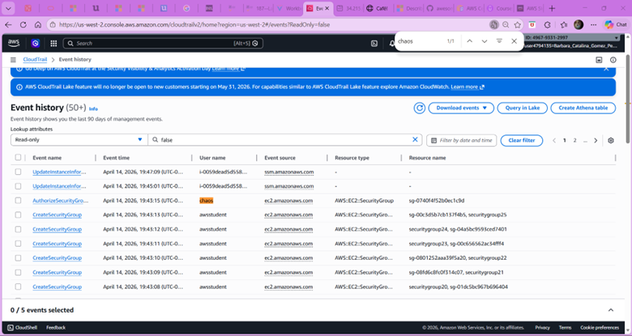
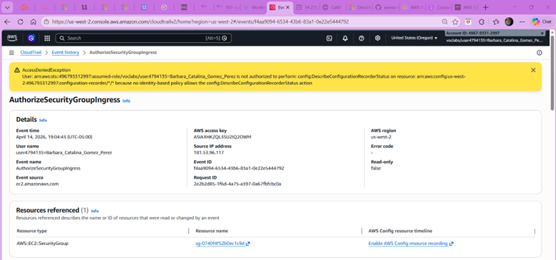

# 🔐 AWS Security Lab: Incident Investigation with CloudTrail

## 📌 Overview

This project demonstrates how to detect, analyze, and investigate a security incident in AWS using **CloudTrail**.

A simulated attack is performed by modifying Security Group rules, exposing a web server and allowing unauthorized changes.

---

## 🧰 Technologies Used

- Amazon EC2
- Security Groups
- AWS CloudTrail
- Amazon S3

---

## 🧩 1. EC2 Instance Deployment

An EC2 instance was launched to host a web application.

---

## 🔐 2. Initial Security Configuration

The Security Group initially allowed only HTTP traffic (port 80), restricting access to the application.

---

## ⚠️ 3. Security Group Modification (Attack Vector)

An inbound rule was added allowing SSH access (port 22) from an external IP.

This change exposed the instance to potential unauthorized access.

---

## 🌐 4. Web Server Validation

The web server was accessed successfully using the public IP address.

---

## ☕ 5. Normal Application State

The application displayed its original content correctly.

---

## 🚨 6. Compromised Application

After unauthorized access, the application content was modified.

This demonstrates the impact of insecure configurations.

---

## 🕵️ 7. CloudTrail Activation

CloudTrail was enabled to log all activity within the AWS environment.

This is critical for auditing and forensic analysis.

---

## 📊 8. Event History Analysis

CloudTrail logs revealed multiple actions related to Security Group changes.

The event `AuthorizeSecurityGroupIngress` was identified as a key indicator of compromise.

---

## 🔍 9. Detailed Event Investigation

The suspicious event was analyzed in detail.

### Key Findings:
- **Event Name:** AuthorizeSecurityGroupIngress  
- **User:** Barbara_Catalina_Gomez_Perez  
- **Source IP:** 181.53.96.117  
- **Resource:** Security Group (sg-0740f4f52b0ec1c9d)  

This confirms that the attack originated from an external IP and modified inbound rules.

---

## 🧠 Key Learnings

- Misconfigured Security Groups can expose infrastructure
- CloudTrail is essential for auditing and investigation
- Monitoring changes in real-time is critical for security
- Even simple misconfigurations can lead to full compromise

---

## 🚀 Conclusion

This lab simulates a real-world cloud security incident and demonstrates how to:

- Detect unauthorized access
- Investigate security events
- Understand the importance of cloud monitoring tools

---

## 👩‍💻 Author

**Barbara Catalina Gomez Perez**  
Cloud / DevOps / Security Learner 🚀
